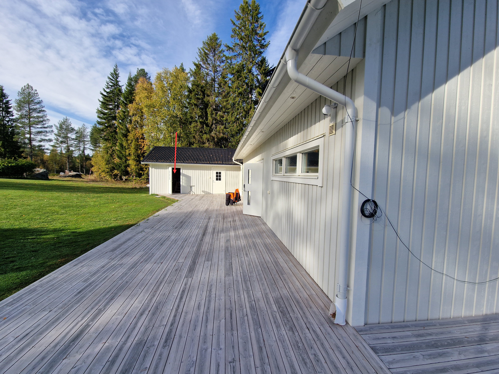

# Plassering av 430X, Bergsvg 49, Hattudden

Det synes en forsenkning i bakken hvor jeg tror den skal stå.

Plassering 26. Sept. 2025

Klipper:  Man kan da telle antall ytterpanel-bord fra hørnet :smiley:

Montering av laddaren på vegg.

Om inte skruene står kvar i veggen, så ligger det skruer i denne boden.  I denne boden ligger det også festeplugger mm., enten på benken eller i skapet over benken.  Og muligens står også huset til klipperen her.
 
